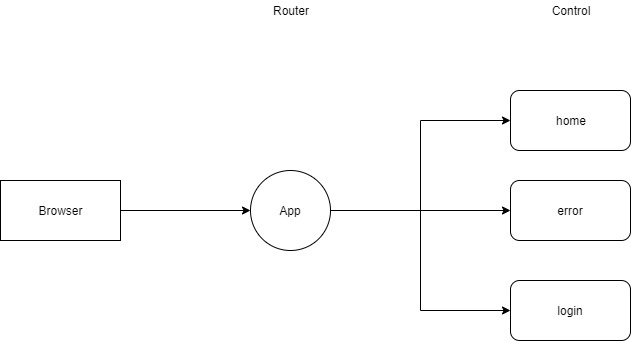

# Express [문법](https://expressjs.com/)

```bash
npm install express --save
```




#### Routing: 길찾기

get이라고 하는 매소드를 router라고 부른다. 그리고 그 하는일을 routing이라고 부름


#### Controller: 처리기

각 상황에 대한 처리를 해준다.


* javascript

  ```javascript
  app.get('/topic/new',function(request,response){
      fs.readdir('data',(err,files)=>{
          if(err){
              console.log(err);
              response.status(500).send("Internal Server Error");
          }
          response.render('new',{pathes:files});
      });
  
  });
  ```

  * /topic/new에 접근하는 것에 대한 처리를 response.render를 통해서 해준다.


# Express의 정적파일

* 텍스트 파일이나 이미지 같은 정적인 파일을 서비스하는 방법

  ```javascript
  app.use(express.static('public'));
  ```

  


# 웹페이지의 표현

* 동적과 정적인 표현으로 나눌 수 있다. 정적인 것은 html파일 등으로 표현하고, 동적인 파일은 직접 html코드를 전송해준다. 

  
  

  * **정적(static.html)**

    ```html
    <!DOCTYPE html>
      <html>
        <head>
          <meta charset="utf-8">
          <title></title>
        </head>
        <body>
            Hello, Dynamic!
            <ul>
              ${lis}
            </ul>
            ${time}
        </body>
      </html>
    ```

    

  * **동적으로 표현(app.js) - root/dynamic으로 접속**

    ```javascript
    var express = require('express');
    var app = express();
    app.use(express.static('public'));
    app.get('/', function(req, res){
        res.send('Hello home page');;
    });
    app.get('/dynamic', function(req, res){
      var lis = '';
      for(var i=0; i<5; i++){
        lis = lis + '<li>coding</li>';
      }
      var time = Date();
      var output = `
      <!DOCTYPE html>
      <html>
        <head>
          <meta charset="utf-8">
          <title></title>
        </head>
        <body>
            Hello, Dynamic!
            <ul>
              ${lis}
            </ul>
            ${time}
        </body>
      </html>`;
      res.send(output);
    });
    app.get('/route', function(req, res){
        res.send('Hello Router, ')
    })
    app.get('/login', function(req, res){
        res.send('<h1>Login please</h1>');
    });
    app.listen(3000, function(){
        console.log('Conneted 3000 port!');
    });
    ```

    

정적으로 생성된 페이지의 경우엔 따로 변수등을 집어넣을 수 없다. 그러나 동적으로 생성했을 때는 변수들을 이용해서 다양한 값들을 표현할 수 있다. 하지만 html코드를 동적으로 직접 작성하게 되면 매우 불편하다. (**`를 이용하여 html 태그 양쪽에 붙여주면 보다 잘 정렬된 코드를 볼 수는 있다.**) 이를 편하게 하기위해서 템플릿 엔진이라는 것을 사용하게 되고 그 중에서 **Jade**를 사용한다.


# Template Engine(Jade)

```bash
npm install jade --save
```


* Jade의 사용(Javascript)

  ```javascript
  app.locals.pretty = true;
  app.set('view engine', 'jade');
  app.set('views', './views');
  
  app.get('/template', function(req, res){
    res.render('temp', {time:Date(), title:'Jade'});
  });
  //옵션을 통해서 변수를 전달한다.
  //Send는 그냥 보내주는것
  //render는 템플릿 엔진을 쓰는것
  ```

  * 그냥  HTML태그나 텍스트만 보내는 것과는 다르게 render매서드를 통해서 보낸다.
  * HTML코드를 보낼때 처럼 객체에 변수를 담아서 보낼 수 있다. {Jade내 사용변수:전달변수}
  * app.locals.pretty옵션에 true를 주게 되면 최종적으로 브라우저에 쏴지는 html코드가 정리되어 진다.


* Jade 문법: [Link](http://jade-lang.com/)