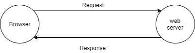
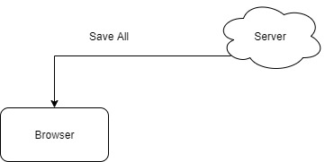
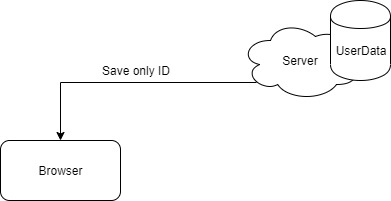

# HTTP

Hyper Text Transfer Protocol

웹에서 통신을 하기 위한 통신규약


## HTTP의 통신



웹 브라우저는  **Request Header**를 통해서 정보요청을 한다.

웹 서버는 **Response Header**를 통해서 요청에 대한 응답을 한다.


# Cookie

쿠키란 필요한 값들을 브라우저에 저장해서 쓰는 방식을 의미한다.(ex 쇼핑몰 장바구니)




쿠키 사용을 위한 미들웨어가 따로 필요함.(Express에서는 기본적으로는 지원하지 않음)


* **설치**

  ```bash
  npm install cookie-parser --save
  ```

  

* **사용**

  ```javascript
  var cookieParser = require('cookie-parser');
  
  app.use(cookieParser());
  
  app.get('/count',(request,response)=>{
      response.cookie('count', 1);
      response.send('count :' +request.cookies.count);
  });
  
  ```

  count라는 값을 cookie로 전송한다.

  
  

* **브라우저에서의 모습**

  


* **브라우저에서 날아온 Cookie는 string으로 날아오기 때문에 파싱을 통해서 이용한다.**

  ```javascript
  app.get('/count',(request,response)=>{
      var count=0;              //쿠키가 없으면 null이다
      if(request.cookies.count){//브라우저로 부터 온 쿠키는 문자열이다.
          count = parseInt(request.cookies.count) + 1;    
      }else{
          count = 0;
      }
      response.cookie('count',count);
      response.send('count :'+ count);
  });
  ```


* **보안측면에서의 Cookie**

  * 기본적으로 브라우저가 Client에 집어 넣고 이용하는 것이기 떄문에 브라우저의 저장소를 가져온다면 쿠키의 데이터를 읽을 수 있어 위험하다

  * 쿠기는 왔다갔다 하면서 평문으로 왔다갔다 하기 때문에 문제가 될 수 있다.

    * 해결책1 : ssl로 암호를 한다.

    * 해결책 2 : 쿠키를 암호화한다.

      ```javascript
      app.use(cookieParser('asdwqqv123424v124vsadasd!#'));		//암호 키값을 준다.
      
      app.get('/count',(request,response)=>{
          var count=0;
          if(request.cookies.count){
              count = parseInt(request.signedCookies.count) + 1;	//암호화 옵션    
          }else{
              count = 0;
          }
          response.cookie('count',count,{signed:true});		//암호화 옵션
          response.send('count :'+ count);
      });
      ```

      

# Session

데이터들은 서버에다가 모두 저장해두고 브라우저에는 누구인지 구분할 식별자만 저장하는 방식



하지만 세션 ID의 저장은 Cookie를 이용해서 저장을한다.


* 설치 

  ```bash
  npm install express-session --save
  ```

  

* 사용

  ```javascript
  var app = express();
  
  app.use(session({
      secret:'123c12v@adv3$341@', //쿠키 세팅을 했으면 같은 값을 넣어도 됨.
      resave:false,               //세션아이디를 접속할때마다 새롭게 발급 받을지?
      saveUninitialized:true      //세션아이디를 사용하기 전까지는 발급받지 말지?
  }))
  
  //현재는 메모리에 웹이 세션을 저장한다.
  //그러므로 이것을 종료하면 값이 초기화된다.
  app.get('/count',(request,response)=>{
      if(request.session.count){
          request.session.count++;
      }else{
          request.session.count =1;
      }
      response.send('count : '+request.session.count);
  })
  ```

  * 서버가 돌아가는 동안 세션마다의 데이터들은 메모리에 저장된다.

  * 메모리에 저장되기 때문에 따라서 서버가 종료되면 값이 날아간다.

    

* 로그인 과정 구현

  ```javascript
  app.get('/welcome',(request,response)=>{
      if(request.session.displayName){		//세션값을 가지고 있다는 것은 로그인좀 해본녀석
          //로그인에 성공
          response.send(`
          <h1>Hello, ${request.session.displayName}</h1>
          <a href="/auth/Logout"> Logout</a>
          `);
      }else{
          response.send(`
          <h1>Welcome</h1>
          <a href="/auth/login"> Login</a>
          `);
      }
  })
  
  
  app.post('/auth/login',(request, response)=>{
      var user={
          username:'user',
          password:'1234',
          displayName: 'admin'
      };
      var username = request.body.username;
      var pwd = request.body.password;
  
      if(username == user.username && pwd == user.password){
          request.session.displayName = user.displayName;		//닉네임 값을 세션에 넣어준다.
          response.redirect('/welcome');
      }else{
          response.send('Who Are You?');
      }
  })
  ```

  


