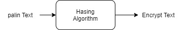
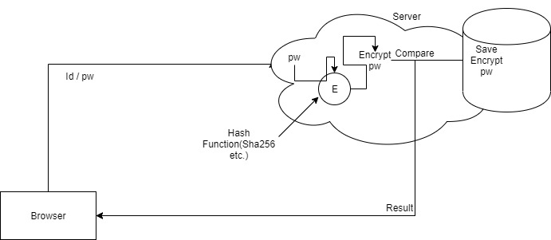
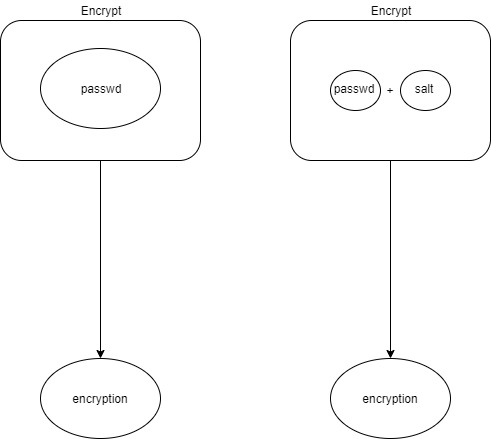

# 비밀번호

#### 비밀번호를 만들때는 단방향 암호화를 많이쓴다.

그중에서 해쉬가 대표적이다(Sha-256 등등)

#### 그러면 로그인 할때 비밀번호 전송은 어떻게 할까?

미리 비밀번호를 만들 때 해싱을 한 값을 저장해두고 로그인시에 날아오는 비밀번호의 해시값과 같은지를 비교한다. 

#### 단순히 해싱만 한다면 나올 수 있는 경우의 수를 다 따지면 그만 아닐까?

임의의 salt라는 넣어서 기존의 암호에 붙인 다음, 그 붙인것을 해싱으로 만든 것을 비교하는 방법을 쓴다면, 기존의 passwd를 알아내기는 더 어려워 준다.

* 한가지 Salt만 가지고 있다면 Salt 자체만 털었을 때 있는 경우를 다 따질 수 있지 않느냐?
  * -> 그것을 방지하기 위해서 id마다 Salt값을 다르게 주어서 비슷하게 되는것을 방지한다.

#### 

#### Key Streching

해싱을 조금더 반복하여 bruteforce Attack에 대한 방지를 하는 Key streching. 

key strching을 쉽게 해줄 수 있는 함수. PBKDF2[link](https://en.wikipedia.org/wiki/PBKDF2)가 있다.

#### 

