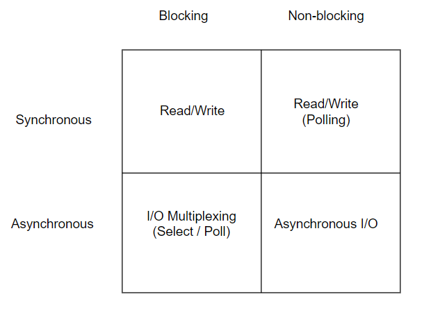
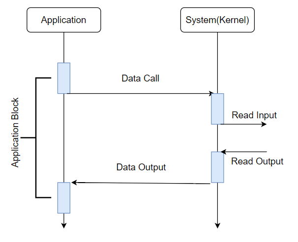
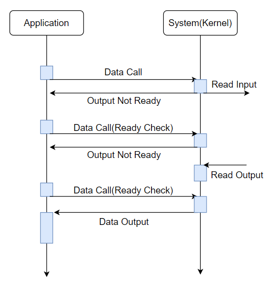
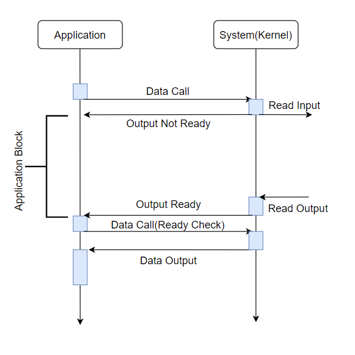
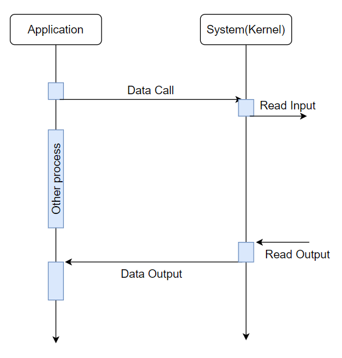

# Synchronous VS Asynchronous(동기와 비동기)

### +Blocking과 NonBlocking

#### 동기(Synvchronous)란?

* 사전적 의미: 동시에 일어난다.
* 프로그래밍에서의 의미: 작업을 요청한 후 작업의 결과가(리턴) 나올 때 까지 기다린 후 처리한다.

#### 비동기(Asynchronous)란?

* 사전적 의미: 동시에 일어나지 않는다.
* 프로그래밍에서의 의미: 직전 시스템 호출의 종료가 발생하면 그에 따른 처리를 진행한다.

#### Blocking이란?

* 사전적 의미: 막는다.
* 프로그래밍에서의 의미: 프로세스가 시스템을 오출 하고 나서 결과가 반환되기까지 다음 처리로 넘어가지 않음.

#### Non-Blocking이란?

* 사전적 의미: 막는다.
* 프로그래밍에서의 의미: 시스템을 호출한 직후에 프로그램으로 제어가 다시 돌아와서 시스템 호출의 종료를 기다리지 않고 다음 처리로 넘어갈 수 있음.

# 각각이 조합된 상황들

1. ### Synchronous Blocking I/O

   

   * 가장 기본적인 I/O 모델로 파일을 읽고 쓰는 일반적인 read,write같은 I/O 시스템 호출을 의미한다. 
   * Data Call호출 후 시스템에서는 데이터가 어플리케이션 버퍼에 복사되기 전까지 리턴하지 않으며 그동안 어플리케이션 프로세스는 자신의 작업을 중단한 채 대기한다.
   * 이 방식으로 서버를 구현할 경우 Client 당 1 Thread를 만들어 연결시킴

2. ### Synchronous Non-Blocking I/O

   

   

   * 어플리케이션에서 최초 데이터 요청 후 시스템에서 작업은 이어지고 시스템에서 Output이 준비되지 않은 상태를 어플리케이션에 즉시 반환하며 Blocking이 일어나지 않는다.

   * 해당작업 이후 어플리케이션에서는 지속적인 데이터 체크를 하고 이를 반복하다가 시스템에 데이터가 적제되면 어플리케이션으로 돌려준 후 종료

   * 지속적으로 상태 체크 후 데이터를 받는 방식을 **Polling** 이라고 함. Blocking에 대한 낭비는 없지만 시스템 호출이 계속일어나 낭비가 발생한다.

     

3. ### Asynchronous Blocking I/O

   

   * 어플리케이션에서 최초 데이터 요청 후 시스템에서 작업은 이어지고 시스템에서 Output이 준비되지 않은 상태를 어플리케이션에 즉시 반환하며 그동안 어플리케이션은 Blocking상태로 대기한다.
   * 대기 상태에서  시스템에서 Output이 준비되었다는 신호를 주게되고 어플리케이션에서 데이터 상태 체크 후  Output을 받아오게 된다.

   
   

4. Asynchronous Non-Blocking I/O

   

   * 시스템 호출을 하면 버퍼의 포인터, 크기 및 완료시 통지 방법 등을 시스템에 전달하고 즉시 리턴한다.
   * 이후 데이터가 버퍼에 복사되어 준비가 완료되면 어플리케이션으로 신호를 발생하여 알려준다.
   * 입력과 출력 사이에 Blocking이나 상태 체크가 없기 때문에 그 사이에 다른 프로세스를 진행할 수 있다.

   

# 2개씩 조합해서 본다면?

* ##### Blocking과 Non-Blocking의 차이: 함수가 바로 리턴 하느냐 마느냐

  * Blocking: 바로 리턴하지 않는다.
  * Non-Blocking: 바로 리턴한다.

* ##### Synchronous와 Asynchronous의 차이: 호출되는 함수의 작업 완료 여부를 누가 신경쓰는가?

  * Synchronous: 호출되는 함수의 작업을 **호출한** 함수가 신경쓴다.
  * Asynchronous: 호출되는 함수의 작업 완료를 **호출 된** 함수가 신경쓴다.

##  Reference

사진 + 그림참조 : [Link](http://wiki.sys4u.co.kr/pages/viewpage.action?pageId=7767390)